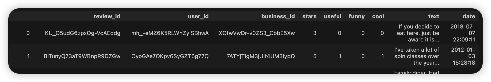

## Project Outline

### Dataset Introduction
* In this analysis, we explore a dataset that comes from [Open source](https://www.yelp.com/dataset) Yelp. It is a subset of Yelp businesses, reviews, and user data for use in connection with academic research. Available as JSON files. 
* It contains 6,990,280 reviews by 1,987,897 users. Use 20,000 rows of them as the dataset
* Use the review.json from open source part in yelp after simple opration

### Dataset preparation
*  For raw data, irrelevant information such as users is discarded. Only select original attributes 'star' and 'text', then construct attribute 'Label' based on the star attribute: where star > 3 as positive reviews, star = 3 as neutral reviews, star < 3 as negative reviews
* 
* Final dataset 
* 
* data_preprocess.ipynb shows more detailed manipulation 
* EDA.ipynb shows the exploratory data analysis
### Algorithm Selection
* Tasks
    * Supervised Learning: Sentence Sentiment Classification, categorized as positive reviews, negative reviews, neutral reviews
    * put them in the Supervised learning folder
     * Implement three methods for Supervised Learning: 2 machine learning and 1 deep learning
     * Machine learning:(Random Forest & SVM); Deep learning: (Bert)

    * Unsupervised Learning: Data dimensionality reduction for text vectorized high dimensional spatial data, and performance comparison by Random Forest's baseline.
    * data_downgrading.ipynb file shows more details in this
      * Implement two methods for Unsupervised Learning: 1 machine learning and 1 deep learning
      * Machine learning:(Since the Embedded data is sparse matrix we use Truncated SVD); Deep learning: (AutoEncoder)
### Findings
* Unsupervised learning: 
    *  Deep learning models can automatically learn a feature representation of the data, eliminating the need to manually design features. This allows deep learning methods to perform well with high-dimensional and complex data. Deep learning models usually require a large amount of data to train or they may overfit.
    * The machine learning algorithm Truncated SVD reduces dimensionality more slowly and is slightly more accurate.
* Supervised learning:
    * find that after further training, BERT has the shortest inference time and the highest accuracy, while SVM is a bit more accurate than Random Forest, but the inference time is much longer

### Appendix 
* UnSupervised learning
    * best_autoencoder_model.pth is the best model for Autoencoder
    * best_svd_model.pkl is the best model for Truncated SVD
* Supervised learning
    * bert_sentiment_model_cpu.pth is the best model for Bert
    * random_forest_with_stop_words.pkl is the best model for Random Forest
    * SVM_best_model.pkl is the best model for SVM