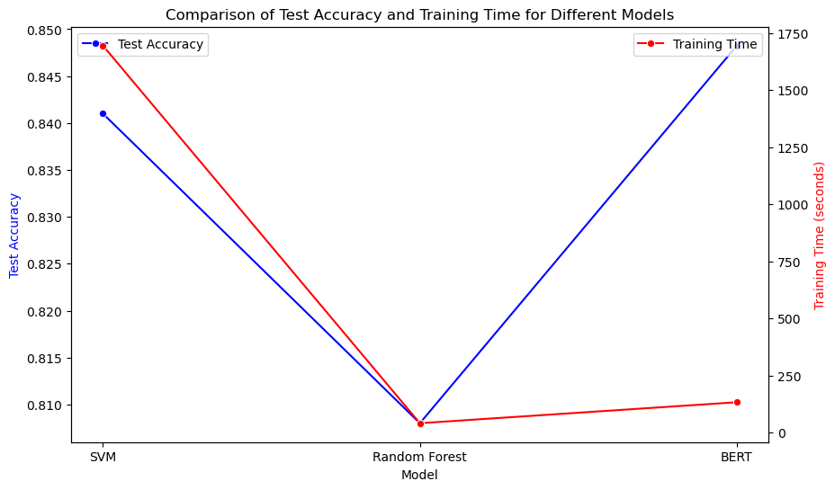

### Performance Summary
| Model                  | Test Accuracy |  Time (seconds) |
|------------------------|---------------|--------------------------|
| Support Vector Machine | 0.841         | 1695.1                   |
| Random Forest          | 0.808         | 41.4                     |
| BERT                   | 0.84825       | 133.3                    |
* Comparison of Test Accuracy and Inferencing Time for Different Models
* find that after further training, BERT has the shortest inference time and the highest accuracy, while SVM is a bit more accurate than Random Forest, but the inference time is much longer

